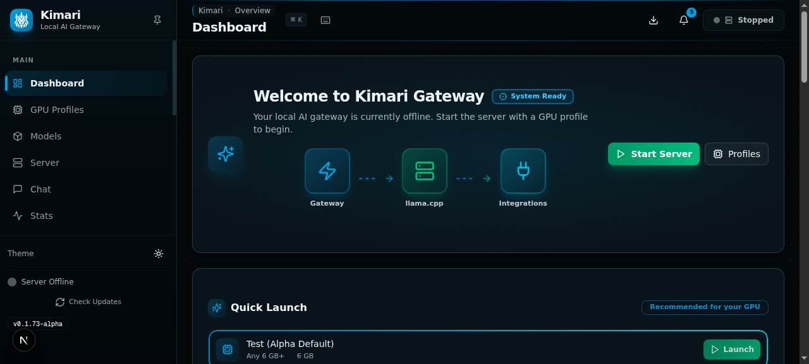
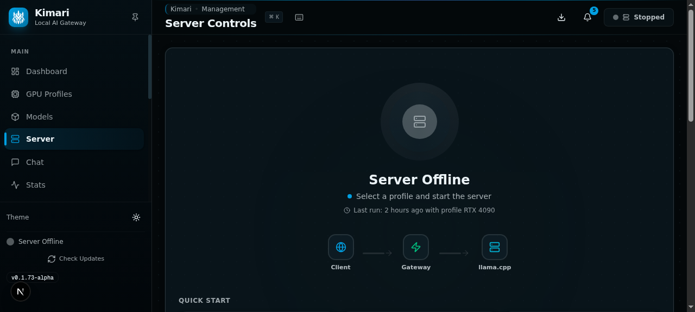
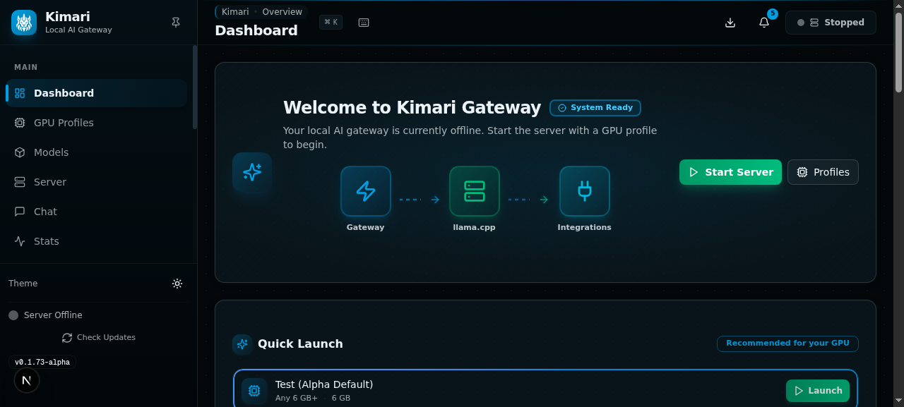
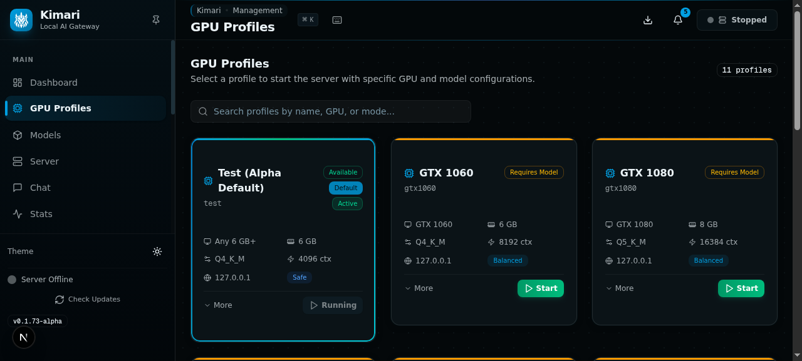

<p align="center">
  
</p>

<h1 align="center">Kimari Local AI</h1>

<p align="center">
  <strong>Run useful local AI on older NVIDIA GPUs.</strong><br>
  <em>Local-first · Open-source · GGUF runtime · Gateway dashboard · Agent-ready</em>
</p>

<p align="center">
  <a href="https://github.com/smouj/kimari-local-ai/actions/workflows/ci.yml">
    
  </a>
  <a href="LICENSE">
    
  </a>
  
  
  
  
</p>

---

## What is Kimari?

**Kimari Local AI** is an open-source framework for running local language models on consumer NVIDIA GPUs, especially older cards such as the **GTX 1060 6GB** and **GTX 1080 8GB**.

Kimari provides:

- a CLI-first local AI workflow;
- GPU-aware profiles;
- llama.cpp / GGUF runtime support;
- an OpenAI-compatible local endpoint;
- a Gateway Dashboard;
- local integration helpers for Open WebUI, Continue.dev, OpenClaw and Hermes;
- private training/evaluation infrastructure for future Kimari models.

> **Status:** alpha software. Useful today, but not production-ready.

---

## Current Truth

**Kimari today is:**
- A local AI framework and CLI.
- A GGUF/llama.cpp workflow for old NVIDIA GPUs.
- A local OpenAI-compatible endpoint helper.
- A Gateway Dashboard preview.

**Kimari today is not:**
- A new inference engine replacing llama.cpp.
- A public Kimari-4B model.
- A production server.
- A benchmark leaderboard.

See [docs/PROJECT_TRUTH.md](docs/PROJECT_TRUTH.md) for the full honesty document.

---

## Why Kimari?

- **Older GPU support** — Designed specifically for GTX 1060 and GTX 1080, not just the latest cards.
- **Zero cloud dependency** — Everything runs locally. No subscriptions, no API keys, no telemetry.
- **OpenAI-compatible** — Drop-in endpoint for existing tools and integrations.
- **CLI-first** — One command to install, one command to start, one command to diagnose.
- **Honest status** — No inflated benchmarks, no "coming soon" claims. Alpha means alpha.

---

## Current Status

| Area | Status |
|---|---|
| Framework / CLI | ✅ Usable alpha |
| Local GGUF runtime | ✅ Working |
| OpenAI-compatible endpoint | ✅ Working |
| GTX 1060 validation | ✅ Validated with TinyLlama test model |
| Gateway Dashboard | ✅ Local preview |
| Open WebUI / Continue / OpenClaw configs | ✅ Documented |
| Kimari SFT/private adapter work | 🔒 Private only |
| Public Kimari-4B weights | ❌ Not released |
| Public GGUF Kimari model | ❌ Not released |
| Release gate | 🔒 BLOCKED |

**Kimari is the framework. Kimari-4B is not released yet.**

No public Kimari weights, adapters or GGUF files are available at this stage.

---

## Quick Start

### One-command install

```bash
curl -fsSL https://raw.githubusercontent.com/smouj/kimari-local-ai/main/install.sh | bash
```

Or the **secure alternative** (recommended for review):

```bash
curl -fsSLO https://raw.githubusercontent.com/smouj/kimari-local-ai/main/install.sh
less install.sh
bash install.sh --dry-run
bash install.sh --with-test-model --yes
```

Then open the guided console:

```bash
kimari console
```

### Manual install

```bash
git clone https://github.com/smouj/kimari-local-ai.git
cd kimari-local-ai
pip install -e .
kimari doctor --deep
```

### Download the test model

```bash
kimari pull test
```

### Start the local API

```bash
kimari start
```

Local endpoint: `http://127.0.0.1:11435/v1`

### Open the Gateway Dashboard

```bash
kimari gateway setup
kimari gateway start --open
```

> The dashboard is controlled through the Kimari CLI. Users should not need to run `npm` manually.

---

## Screenshots

| Gateway Overview | Gateway Server |
|---|---|
|  |  |

| Gateway Analytics | Gateway Profiles |
|---|---|
|  |  |

> **Note:** The Gateway Dashboard runs at `http://127.0.0.1:3105`. Start it with `kimari gateway start --open`.

> See [docs/SCREENSHOTS.md](docs/SCREENSHOTS.md) for the full gallery.

---

## Gateway Dashboard

Kimari includes a local dashboard for monitoring and managing your local AI environment.

```bash
kimari gateway start --open
```

The dashboard shows:

- local runtime status;
- GPU and VRAM information;
- model status;
- profiles;
- integrations;
- logs;
- experimental chat playground;
- release gate status.

Security defaults:

| Setting | Default |
|---|---|
| Host | `127.0.0.1` |
| Public bind | Disabled |
| Mode | Local preview |
| Gate | `BLOCKED` |
| Tokens in UI | No |
| Public model upload | No |

> See [docs/GATEWAY_DASHBOARD.md](docs/GATEWAY_DASHBOARD.md) for details.

---

## Local Runtime Validation

Kimari has been tested on a real **NVIDIA GTX 1060 6GB** under WSL2 with llama-server CUDA.

| Metric | CUDA GTX 1060 | CPU-only |
|---|---:|---:|
| Prompt processing | 228 tok/s | 77 tok/s |
| Token generation | 73 tok/s | 33 tok/s |
| Model VRAM | 1221 MiB | — |

| Detail | Value |
|---|---|
| GPU | NVIDIA GeForce GTX 1060 6GB |
| OS | WSL2 Ubuntu 24.04 |
| Backend | llama-server CUDA |
| Test model | TinyLlama 1.1B Q4_K_M |
| Kimari-4B | Not released |

> This validation uses TinyLlama as a test model. It is not a Kimari-4B benchmark.

See [docs/GTX1060_SHOWCASE.md](docs/GTX1060_SHOWCASE.md) and [docs/GTX1060_LOCAL_RUNTIME_RESULT.md](docs/GTX1060_LOCAL_RUNTIME_RESULT.md).

---

## What Works Today

| Feature | Command / Docs |
|---|---|
| Diagnostics | `kimari doctor --deep` |
| Guided setup | `kimari setup --write --yes` |
| Test model download | `kimari pull test` |
| Local API server | `kimari start` |
| Chat via CLI | `kimari chat "hello"` |
| Gateway dashboard | `kimari gateway start --open` |
| Open WebUI config | `kimari integrations generate --target openwebui` |
| Continue.dev config | `kimari integrations generate --target continue` |
| OpenClaw config | `kimari integrations generate --target openclaw` |
| Model verification | `kimari models hash` / `kimari models verify` |
| Update check | `kimari update check --online` |
| Performance tuning | `kimari optimize` / `kimari perf` |
| Benchmark | `kimari benchmark --dry-run` |

> Full CLI reference: [docs/CLI_REFERENCE.md](docs/CLI_REFERENCE.md)

---

## Model Status

Kimari currently runs compatible local GGUF models. Official Kimari models are still private or planned.

| Model line | Status |
|---|---|
| TinyLlama test profile | ✅ Available for validation |
| Kimari Runtime 1.5B | 🔒 Private experiments |
| Kimari Core 3B | 🔒 Private experiments |
| Kimari-4B | ❌ Not released |
| Official Kimari GGUF | ❌ Not released |

Kimari follows an open-license model policy. Official public releases must use permissive-compatible base models and pass private evaluation, manual review and local GGUF validation.

See [docs/KIMARI4B_RELEASE_GATE.md](docs/KIMARI4B_RELEASE_GATE.md), [docs/KIMARI_OPEN_LICENSE_POLICY.md](docs/KIMARI_OPEN_LICENSE_POLICY.md), [docs/KIMARI_BASE_MODEL_LICENSE_MATRIX.md](docs/KIMARI_BASE_MODEL_LICENSE_MATRIX.md).

---

## Training and Evaluation Status

Private training/evaluation work is active, but not public release material yet.

| Area | Status |
|---|---|
| SFT dataset seed | ✅ Created |
| Private adapters | 🔒 Private |
| Private scoring | 🔒 Private |
| Manual review | In progress / gated |
| Public benchmark | ❌ None |
| Public weights | ❌ None |
| Public GGUF | ❌ None |

See:

- [docs/KIMARI4B_RELEASE_GATE.md](docs/KIMARI4B_RELEASE_GATE.md)
- [docs/KIMARI_OPEN_LICENSE_POLICY.md](docs/KIMARI_OPEN_LICENSE_POLICY.md)
- [docs/KIMARI4B_RUN_HISTORY.md](docs/KIMARI4B_RUN_HISTORY.md)
- [docs/KIMARI_EVAL_PRIVATE_V1.md](docs/KIMARI_EVAL_PRIVATE_V1.md)

---

## Run agents today with public GGUF models

Kimari-4B is not public yet. For real local agent workflows today, use:

- `agent-qwen1060` — GTX 1060 6GB, Qwen3-4B Q4_K_M, 4K context
- `agent-qwen1080` — GTX 1080 8GB, Qwen3-4B Q4_K_M, 8K context
- `agent-smollm1060` — safer 3B fallback for GTX 1060

```bash
kimari pull recommended
kimari start --profile agent-qwen1060
```

See [docs/RUN_AGENTS_NOW.md](docs/RUN_AGENTS_NOW.md).

---

## GPU Profiles

| Profile | GPU | VRAM | Quantization | Context | Status |
|---|---|---|---|---|---|
| `test` | Any 6 GB+ | 6 GB | Q4_K_M | 4,096 | **Default (alpha)** |
| `agent-qwen1060` | GTX 1060 | 6 GB | Q4_K_M | 4,096 | ✅ Public model |
| `agent-qwen1080` | GTX 1080 | 8 GB | Q4_K_M | 8,192 | ✅ Public model |
| `agent-smollm1060` | GTX 1060 | 6 GB | Q4_K_M | 4,096 | ✅ Public model (low VRAM) |
| `gtx1060` | GTX 1060 | 6 GB | Q4_K_M | 8,192 | Requires Kimari-4B |
| `gtx1080` | GTX 1080 | 8 GB | Q5_K_M | 16,384 | Requires Kimari-4B |
| `turbo` | 6 GB+ | 6 GB | IQ4_XS | 8,192 | Requires Kimari-4B |

> The `test` profile is the default during alpha, using TinyLlama 1.1B. For real agent work, use `agent-qwen1060` or `agent-smollm1060` with public GGUF models. When Kimari-4B is published, `gtx1060` will become the new default.

---

## Documentation

### Getting started

| Topic | Link |
|---|---|
| Install guide | [docs/INSTALL_ONE_COMMAND.md](docs/INSTALL_ONE_COMMAND.md) |
| Console guide | [docs/KIMARI_CONSOLE.md](docs/KIMARI_CONSOLE.md) |
| Gateway dashboard | [docs/GATEWAY_DASHBOARD.md](docs/GATEWAY_DASHBOARD.md) |
| CLI reference | [docs/CLI_REFERENCE.md](docs/CLI_REFERENCE.md) |
| Local endpoint test | [docs/LOCAL_OPENAI_ENDPOINT_TEST.md](docs/LOCAL_OPENAI_ENDPOINT_TEST.md) |
| Run agents now | [docs/RUN_AGENTS_NOW.md](docs/RUN_AGENTS_NOW.md) |

### Integrations

| Tool | Link |
|---|---|
| Open WebUI | [docs/OPENWEBUI_LOCAL_SETUP.md](docs/OPENWEBUI_LOCAL_SETUP.md) |
| OpenClaw | [docs/OPENCLAW_LOCAL_SETUP.md](docs/OPENCLAW_LOCAL_SETUP.md) |
| Continue.dev | [docs/CONTINUE_LOCAL_SETUP.md](docs/CONTINUE_LOCAL_SETUP.md) |
| Hermes | [docs/OPENWEBUI_OPENCLAW_QUICK_CONFIG.md](docs/OPENWEBUI_OPENCLAW_QUICK_CONFIG.md) |

### Model and training policy

| Topic | Link |
|---|---|
| Release gate | [docs/KIMARI4B_RELEASE_GATE.md](docs/KIMARI4B_RELEASE_GATE.md) |
| Open-license policy | [docs/KIMARI_OPEN_LICENSE_POLICY.md](docs/KIMARI_OPEN_LICENSE_POLICY.md) |
| Dataset policy | [docs/KIMARI_SFT_V1_DATASET.md](docs/KIMARI_SFT_V1_DATASET.md) |
| Eval plan | [docs/KIMARI_EVAL_PRIVATE_V1.md](docs/KIMARI_EVAL_PRIVATE_V1.md) |
| Training history | [docs/KIMARI4B_RUN_HISTORY.md](docs/KIMARI4B_RUN_HISTORY.md) |
| Training plan | [docs/MODEL_TRAINING_PLAN.md](docs/MODEL_TRAINING_PLAN.md) |

### Advanced

| Topic | Link |
|---|---|
| Performance tuning | [docs/PERFORMANCE_TUNING_PLAN.md](docs/PERFORMANCE_TUNING_PLAN.md) |
| Model hashing | [docs/MODEL_HASHING.md](docs/MODEL_HASHING.md) |
| Benchmarks | [docs/MEASURED_BENCHMARKS.md](docs/MEASURED_BENCHMARKS.md) |
| Experimental API | [docs/API_EXPERIMENTAL.md](docs/API_EXPERIMENTAL.md) |
| PyPI release gate | [docs/PYPI_RELEASE_GATE.md](docs/PYPI_RELEASE_GATE.md) |
| Architecture | [docs/00-03_architecture.md](docs/00-03_architecture.md) |
| Security | [SECURITY.md](SECURITY.md) |
| Privacy | [PRIVACY.md](PRIVACY.md) |

---

## Hugging Face

| Resource | Link |
|---|---|
| Kimari organization | [https://huggingface.co/kimari-ai](https://huggingface.co/kimari-ai) |
| Kimari Fit Lab | [https://huggingface.co/spaces/kimari-ai/kimari-fit-lab](https://huggingface.co/spaces/kimari-ai/kimari-fit-lab) |
| Reference GGUF collection | [https://huggingface.co/collections/Smouj013/kimari-compatible-gguf-models-6a0352c75d2bfeff34d51e66](https://huggingface.co/collections/Smouj013/kimari-compatible-gguf-models-6a0352c75d2bfeff34d51e66) |

> The Hugging Face Space is a compatibility/demo tool. It does not run Kimari-4B. The collection contains reference/community GGUF models, not official Kimari models.

---

## Roadmap

| Stage | Goal |
|---|---|
| ✅ Current | Local runtime + Gateway Dashboard + GitHub Pages landing page + Console + Installer |
| Next | Private adapter runtime preview |
| Next | Agent Gateway tools and web-search dry-run |
| Next | Manual review of private outputs |
| Later | Private GGUF export |
| Later | Public preview decision |

See [ROADMAP.md](ROADMAP.md) for the full roadmap.

---

## Safety

Kimari is local-first and conservative by default:

- localhost-only defaults;
- no public bind unless explicitly requested;
- no token storage in dashboard;
- no public model upload;
- no public GGUF;
- no benchmark claims without reproducible validation;
- no automatic gate transitions.

---

## Community

- [Code of Conduct](CODE_OF_CONDUCT.md)
- [Contributing Guide](CONTRIBUTING.md)
- [Security Policy](SECURITY.md)
- [Support](SUPPORT.md)
- [Governance](GOVERNANCE.md)

---

## License

Kimari Local AI is released under the MIT License. See [LICENSE](LICENSE).

Model weights are not included in this repository. See [MODEL_LICENSES.md](MODEL_LICENSES.md) for model licensing information.

---

<p align="center">
  Made by <a href="https://x.com/smouj013"><strong>Smouj</strong></a> · <a href="https://github.com/smouj/kimari-local-ai">GitHub</a> · <a href="https://smouj.github.io/kimari-local-ai/">Website</a>
</p>
