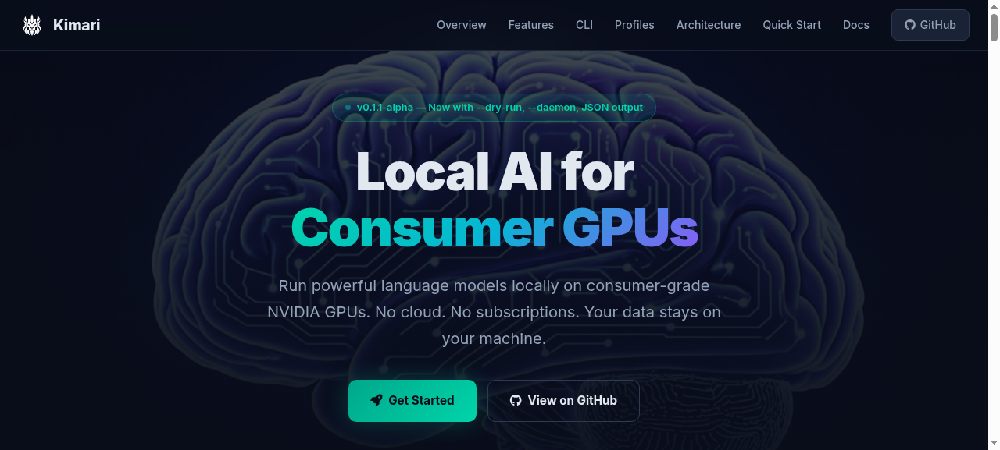

<p align="center">
  
</p>

<h1 align="center">Kimari</h1>

<p align="center">
  <strong>Local AI for Consumer GPUs</strong>
</p>

<p align="center">
  <a href="LICENSE">MIT License</a> ·
  <a href="https://github.com/smouj/kimari-local-ai">GitHub</a> ·
  <a href="https://smouj.github.io/kimari-local-ai/"></a> ·
  <a href="https://x.com/smouj013"></a> ·
  <a href="https://www.python.org/downloads/"></a>
  <a href="https://developer.nvidia.com/cuda-downloads"></a>
  <a href="https://github.com/ggerganov/llama.cpp"></a>
</p>

---

<p align="center">
  <a href="https://smouj.github.io/kimari-local-ai/">
    
  </a>
</p>

<p align="center"><em>Visit <a href="https://smouj.github.io/kimari-local-ai/">smouj.github.io/kimari-local-ai</a> for the full experience</em></p>

---

## Overview

Kimari is an open-source framework for running powerful language models locally on consumer-grade NVIDIA GPUs. No cloud. No subscriptions. Your data stays on your machine.

Kimari-4B is the **target model** currently under development. Until the final fine-tuned weights are released, Kimari can run any compatible GGUF model (Qwen3, SmolLM3, Llama 3.2, etc.) on consumer hardware — specifically **NVIDIA GTX 1060 (6 GB)** and **GTX 1080 (8 GB)** — delivering maximum useful intelligence per GiB of VRAM through intelligent quantization and the KimariFit scoring system.

Built on top of [llama.cpp](https://github.com/ggerganov/llama.cpp), Kimari provides an OpenAI-compatible API, a full-featured CLI, and integrations for Open WebUI and Continue (VS Code / JetBrains).

## Project Status

> **Kimari Local AI v0.1.1-alpha** — Framework/runtime/CLI is functional. Kimari-4B model is planned.

| Component | Status |
|-----------|--------|
| CLI (`kimari`) | ✅ Functional alpha |
| llama.cpp runtime | ✅ Works with any GGUF model |
| Open WebUI integration | ✅ Functional via Docker |
| Continue IDE integration | ✅ Configuration ready |
| Kimari-4B model | 🔨 Planned — weights not yet available |
| Real GPU benchmarks | 📋 Pending — need measured data |
| PWA (own web app) | 📋 Planned for v0.2 |
| Tauri Desktop | 📋 Planned for v1.0 |
| `kimari pull` (model download) | 📋 Planned for v0.1.2 |

## Why Kimari?

| Feature | Description |
|---------|-------------|
| 🔒 **Privacy First** | Your data never leaves your machine. Zero cloud dependency. Zero telemetry. |
| 🎮 **Consumer GPU Optimized** | Designed for real hardware, not datacenter GPUs. GTX 1060 and up. |
| ⚡ **Fast Inference** | Powered by llama.cpp with CUDA acceleration. Flash attention support. |
| 📊 **KimariFit Score** | Proprietary metric: useful intelligence per GiB of VRAM. Know before you run. |
| 🖥️ **Open Source** | MIT licensed. Inspect, modify, contribute. No lock-in. |
| 🌐 **OpenAI-Compatible API** | Drop-in replacement for OpenAI API. Works with existing tooling. |
| 🧩 **IDE Integration** | First-class Continue.dev support for VS Code and JetBrains. |
| 🌐 **Bilingual** | English and technical Spanish support. |

## Quick Start

### Prerequisites

- NVIDIA GPU (GTX 1060 6GB or better recommended)
- CUDA Toolkit 11.8+
- Python 3.10+
- Git
- 8 GB+ system RAM

### Installation

```bash
# 1. Clone the repository
git clone https://github.com/smouj/kimari-local-ai.git
cd kimari-local-ai

# 2. Install Python dependencies
pip install -r cli/requirements.txt

# 3. Run system diagnostics
python cli/kimari_cli.py doctor

# 4. Download a GGUF model and place in models/
#    See docs/00-04_local_runtime.md for recommended models

# 5. Start the server with the test profile
python cli/kimari_cli.py start --profile test

# 6. Chat with the model
python cli/kimari_cli.py chat "Hello, Kimari!"
```

> **Note:** The `test` profile is the only profile usable out of the box. The `gtx1060` and `gtx1080` profiles require the Kimari-4B GGUF model (not yet published) — or you can edit the profile in `config/kimari.profiles.json` to point to your own GGUF file.

### Linux (Ubuntu 22.04+)

```bash
# Install system dependencies
sudo apt update
sudo apt install -y build-essential cmake nvidia-cuda-toolkit git

# Build llama.cpp with CUDA support
bash scripts/linux/build-llamacpp-cuda.sh

# Install Python dependencies
pip install -r cli/requirements.txt

# Run diagnostics
python cli/kimari_cli.py doctor
```

### Windows

```powershell
# Install CUDA Toolkit from NVIDIA
# Install Python 3.10+
pip install -r cli\requirements.txt
.\scripts\windows\start-kimari-1080.ps1
```

## GPU Profiles

Pre-configured settings optimized for specific GPU models. No manual tuning required.

| Profile | GPU | VRAM | Quantization | Context | Batch | UBatch | KV Cache |
|---------|-----|------|-------------|---------|-------|--------|----------|
| `gtx1060` | GTX 1060 | 6 GB | Q4_K_M | 8,192 | 256 | 128 | f16 |
| `gtx1080` | GTX 1080 | 8 GB | Q5_K_M | 16,384 | 512 | 256 | f16 |
| `turbo` | 6 GB+ | 6 GB | IQ4_XS | 16,384 | 256 | 128 | q8_0 |
| `test` | Any 6 GB+ | 6 GB | Q4_K_M | 4,096 | 128 | 64 | f16 |

## CLI Commands

```bash
kimari doctor                                        # System diagnostics
kimari start --profile gtx1080                       # Start server
kimari stop                                          # Stop server
kimari status                                        # Check server status
kimari chat "Your message here"                      # Send a single message
kimari chat                                          # Interactive chat mode
kimari bench --profile gtx1080                       # Run benchmarks (tokens/s, TTFT)
kimari fit --model models/file.gguf --ctx 8192       # KimariFit score
kimari models                                         # List available GGUF models
kimari profiles                                       # List GPU profiles
kimari start --profile test --dry-run                # Preview command without running
kimari start --profile gtx1080 --daemon              # Start in background
kimari logs                                          # Show server logs
kimari logs --follow                                 # Tail logs
kimari doctor --json                                 # JSON output for automation
kimari status --json                                 # JSON status output
kimari bench --profile test --json                   # JSON benchmark output
```

## KimariFit Score

The KimariFit formula measures useful intelligence density per GiB of VRAM. It answers: *"Will this model run well on my GPU?"*

```
M_total ≈ S_GGUF + C/9709 + overhead
```

Where:
- `S_GGUF` = Model file size in GiB
- `C` = Context window size in tokens
- `overhead` = 0.8–1.3 GiB (runtime overhead)

The KimariFit Score (0–100) evaluates:
- **VRAM utilization efficiency** — Target: 85–92% of available VRAM
- **Quantization quality retention** — Higher quantization = better score
- **Stability** — OOM probability estimation
- **Inference speed potential** — Based on model-to-VRAM ratio

| Score | Rating | Meaning |
|-------|--------|---------|
| 90–100 | 🟢 Optimal | Model fits perfectly. Best performance expected. |
| 70–89 | 🟡 Good | Minor compromises. Works well for most tasks. |
| 50–69 | 🟠 Usable | Significant quantization. Acceptable for basic use. |
| < 50 | 🔴 Poor | Will be slow or OOM. Not recommended. |

```bash
python cli/kimari_cli.py fit --model models/Kimari-4B-Q4_K_M.gguf --ctx 8192
```

See [docs/00-02_kimarifit_formula.md](docs/00-02_kimarifit_formula.md) for the full formula.

## Architecture

```
┌─────────────────────────────────────────────┐
│  GGUF Quantized Model (any compatible GGUF) │
├─────────────────────────────────────────────┤
│  llama.cpp Runtime + CUDA Acceleration      │
├─────────────────────────────────────────────┤
│  llama-server (OpenAI-compatible API)       │
│  http://127.0.0.1:11435/v1                  │
├─────────────────────────────────────────────┤
│  CLI · Open WebUI · PWA · Continue (IDE)    │
└─────────────────────────────────────────────┘
```

- **CLI** — Python 3.10+ command-line interface for all operations
- **Open WebUI** — Full-featured web chat interface (Docker)
- **Continue** — AI coding assistant for VS Code and JetBrains
- **PWA** — Planned lightweight web app (v0.2)
- **Desktop** — Planned Tauri native app (v1.0)

## Documentation

| Document | Description |
|----------|-------------|
| [Product Vision](docs/00-01_product_vision.md) | Project goals, philosophy, and differentiation |
| [KimariFit Formula](docs/00-02_kimarifit_formula.md) | Hardware scoring system explained |
| [Architecture](docs/00-03_architecture.md) | System design and data flow |
| [Local Runtime](docs/00-04_local_runtime.md) | llama.cpp setup, CUDA, and tuning |
| [CLI Spec](docs/00-05_cli_spec.md) | CLI commands, options, and output formats |
| [Web & Desktop](docs/00-06_web_pwa_desktop.md) | PWA and Tauri desktop plans |
| [IDE Integration](docs/00-07_ide_integration.md) | Continue.dev setup and configuration |
| [Dataset & Tuning](docs/00-08_dataset_tuning.md) | Fine-tuning roadmap and data pipeline |
| [Security & Governance](docs/00-09_security_governance.md) | Privacy, security model, responsible AI |
| [Service Status](docs/00-10_service_status.md) | Roadmap, milestones, version history |
| [Compatibility](docs/00-11_tech_stack_compatibility.md) | Supported platforms and GPU matrix |
| [Runtime Validation](docs/11_NEXT_RUNTIME_VALIDATION.md) | Step-by-step runtime validation guide |

## Contributing

We welcome contributions! See [CONTRIBUTING.md](CONTRIBUTING.md) for guidelines.

## License

This project is licensed under the MIT License — see [LICENSE](LICENSE) for details.

Model weights are not included in this repository. See [MODEL_LICENSES.md](MODEL_LICENSES.md) for information about model licensing.

## Acknowledgments

- [llama.cpp](https://github.com/ggerganov/llama.cpp) — Inference runtime engine
- [GGUF format](https://github.com/ggerganov/ggml) — Efficient model format
- [Ollama](https://github.com/ollama/ollama) — Inspiration for open-source AI tooling
- [Continue](https://continue.dev) — Open-source AI code assistant
- [Open WebUI](https://github.com/open-webui/open-webui) — Web interface for LLMs

---

<p align="center">
  Created by <a href="https://x.com/smouj013">Smouj</a> · <a href="https://github.com/smouj/kimari-local-ai">GitHub</a>
</p>
