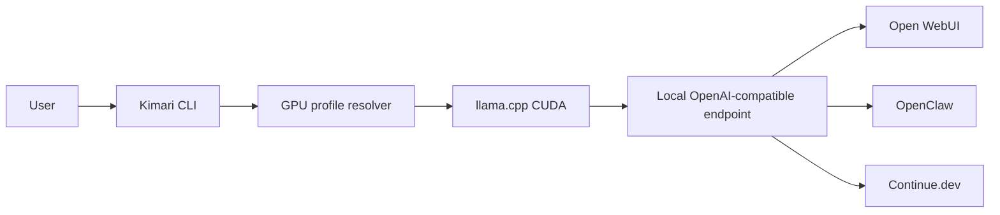

# Kimari Flow Diagram

## Notes

- The endpoint is local by default: `http://127.0.0.1:11435/v1`.
- Kimari runs compatible GGUF models through llama.cpp.
- Kimari-4B is not released yet.
- Gate: **BLOCKED**.
